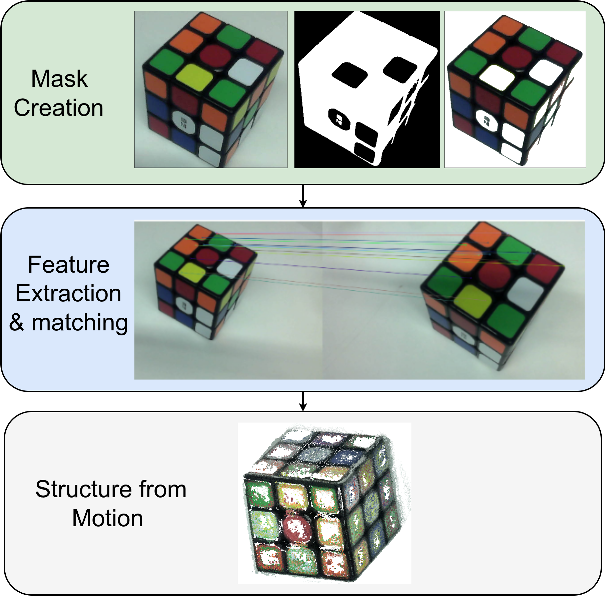

# Data processing pipeline




# Setup

Hardware

1) setup environmnetn:

`pip install -r environments/lerobot_env.yaml`


Ports:
arduino: ttyUSB0
arm: ttyACM0

# how to run traversal

python so101_play_poses.py --file /home/dimitrios/git_repos/robotics_hackathon/demo_scripts/state/captures/follower_test.json --id my_follower


# Data Processing 
create environment:
```
conda env create -f environment.yml
conda activate sfm # structure from motion
```

# to run the 3D reconstruction for images
update the following paths according to your image folder and prefered output directory:
```
IMAGE_DIR   = Path(f"PATH_TO_YOU_IMAGE_FOLDER")
WORK_DIR    = Path("./work")
OUT_DIR     = Path("./outputs")
```

to use your images use `image_to_pcd.py`:

```
python image_to_pcd.py
```


